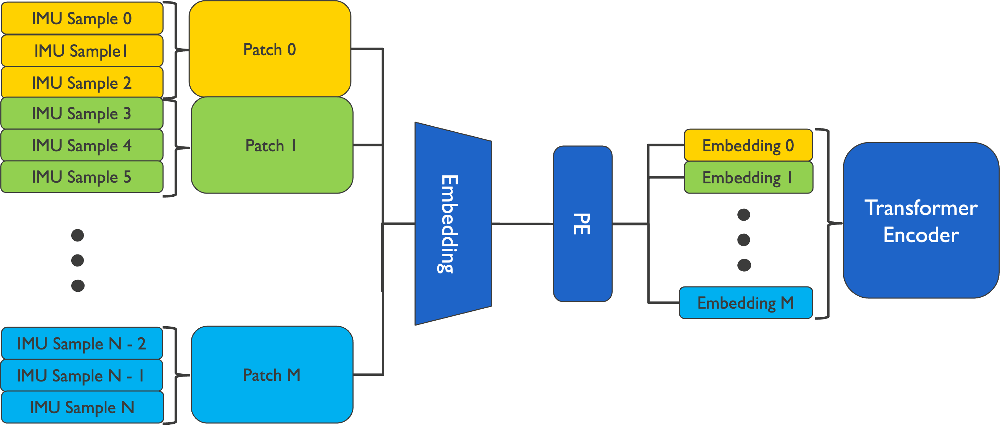
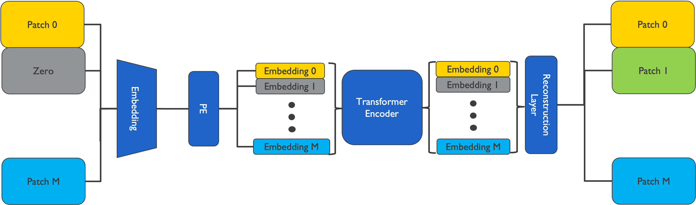
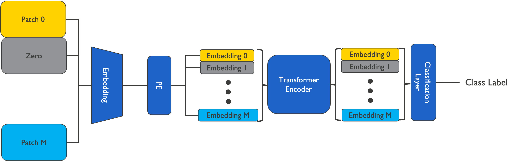

# AAR Time Series Foundation Model
## Set-up
Run `pip install -r requirements.txt` in the root of this repository.

## Data preparation
### Dataset to HDF5 conversion
All datasets should be converted to the HDF5 format, for this the `dataset_to_hdf5` function from `data/utils.py` can be used. Every contiguous recording should be its own HDF5 file. Each different sensor will be turned into a separate `Dataset` in the HDF5 file.

The `data` folder already contains several example scripts for converting datasets into the required format (i.e. `data/process_horsing_around.py`). An example of the resulting file structure is given below:

```
dataset_name
|-- species_0_ds_0.hdf5
|-- species_0_ds_1.hdf5
|-- species_0_ds_2.hdf5
|-- species_1_ds_0.hdf5
`-- species_1_ds_1.hdf5
```

### Pretraining data
To pretrain the foundation model Numpy arrays containing the training and evaluation segments must be created from the HDF5 files. To do this the `data/data_preparation_pretraining.py` script can be used. This takes in several CLI parameters to configure the creation of the training and validation arrays as explained below:

|Parameter                |Default value|Description|
|-------------------------|-------------|-----------|
|`--data_root`            |             |Path of the root folder where the processed HDF5 datasets are stored.|
|`--output_folder`        |             |Path to the folder where to store the processed pretraining numpy arrays.|
|`--datasets`             |             |Names of the folders/datasets in `--data_root` to be used for pretraining.|
|`--train_ratio`          |0.5          |Percentage of individual subjects used for training (Range [0.0, 1.0]).|
|`--max_dataset_imbalance`|4.0          |The maximum imbalance allowed between the smallest and largest datasets included (i.e if the smallest dataset contains 10 hours of data and the largest dataset contains 100 hours of data, with a maximum dataset imbalance of 4.0 only 10 hours * 4.0 = 40 hours of data will be included in the training data).|
|`--oversampling_factor`  |5.0          |The amount by which each dataset will be oversampled (i.e. with an oversampling factor of 5.0 a dataset containing 10 hours of data will be sampled in such a way that the total duration of all segments in the training array will amount to 50 hours of data).|
|`--segment duration`     |10.0         |The duration of each individual segment in the pretraining arrays, in number of seconds.|
|`--max_window_length`    |1000         |The maximum length of segments in number of accelerometer samples. Segments shorter than the maximum window length will be zero padded until they reach the maximum window length.|
|`--random_seed`          |578          |The random seed used to ensure reproducibility.|

An example of how to call this script is given below, this will use 2 datasets for pretraining (horses_2022 and cows_2023). The horses dataset contains data from 20 animals captured at 25Hz and a total of 23 hours of data, and the cows dataset contains data from 100 animals captured at 100 Hz with a total of 500 hours of data. We will use a train ratio of 50%, a maximum dataset imbalance of 5, an oversampling factor of 4. The segments for each dataset will be 20 seconds long with a maximum window length of 20 seconds * 100Hz = 2000 samples.

`python data/data_preparation_pretraining.py --data_root /data/aar/processed_data --output_folder /data/aar/training_snapshots/pretraining --datasets horses_2022 cows_2023 --train_ratio .50 --max_dataset_imbalance 5 --oversampling_factor 4 --segment_duration 20 --max_window_length 2000`

This will result in a training dataset containing data from 10 horses and 50 cows, the other animals will be used for the validation dataset. If we assume that both the training and validation datasets contain an equal amount of hours of data (23 / 2 = 11.5 hours for the horses, and 500 / 2 = 250 hours for the cows) then we can calculate the resulting amount of segments as follows. The smallest dataset will be oversampled by the oversampling factor, so 11.5 hours * 4 = 46 hours, the largest dataset will then be capped to 46 hours * 5 = 230 hours. So for the horses there will be 46 hours / 20 seconds = 8 280 segments extracted, and for the cows there will be 41 000 segments extracted, each of a 20 second duration. The segments will be extracted from the input data by generating random starting indices, so no sliding window approach is used. The resulting training and validation arrays will be stored in the folder indicated by the `--output_folder` argument as `X_train.npy` and `X_val.npy`. The dimensions of these arrays is `(n_segments, 3)`, as each different 3-axis accelerometer in every dataset will be processed seperately.

### Finetuning data
For fine-tuning labeled Numpy arrays containing the training and evaluation data need to be generated from the HDF5 files of a labeled dataset. This can be done using the `data/data_preparation_finetuning.py` script. This script takes in the path of the folder where the processed HDF5 files from a labeled dataset are stored and generates the training and validation arrays. Our approach directly supports the use of N-fold cross validation. After generation the directory structure for a 4-fold CV will look as follows:
```
output_folder
`-- dataset_name
    |-- fold_0
        |-- X_train.npy
        |-- y_train.npy
        |-- X_val.npy
        `-- y_val.npy
    |-- fold_1
        |-- X_train.npy
        |-- y_train.npy
        |-- X_val.npy
        `-- y_val.npy
    |-- fold_2
        |-- X_train.npy
        |-- y_train.npy
        |-- X_val.npy
        `-- y_val.npy
    `-- fold_3
        |-- X_train.npy
        |-- y_train.npy
        |-- X_val.npy
        `-- y_val.npy
```

This script contains the following CLI parameters to configure the data processing:
|Parameter                |Default value|Description|
|-------------------------|-------------|-----------|
|`--data_root`            |             |Path to the folder where the processed HDF5 files of the datasets are stored.|
|`--output_folder`        |             |Path of where the training and validation Numpy arrays need to be stored.|
|`--dataset_name`         |             |Name of the folder/dataset in `--data_root` to be used for generating the fine-tuning data.|
|`--segment duration`     |10.0         |The duration of each individual segment in the pretraining arrays, in number of seconds.|
|`--max_window_length`    |1000         |The maximum length of segments in number of accelerometer samples. Segments shorter than the maximum window length will be zero padded until they reach the maximum window length.|
|`--n_folds`             |4            |The number of folds to generate for the N-fold cross validation.|
|`--random_seed`          |578          |The random seed used to ensure reproducibility.|

An example of how to call this script is given below. This will generate the fine-tuning data for the horses_2022_labeled dataset, using a 4-fold cross-validation split. The segments will be 10 seconds long with a maximum window length of 1000 samples.

`python data/data_preparation_finetuning.py --data_root /data/aar/processed_data --output_folder /data/aar/training_snapshots/finetuning --dataset_name horses_2022_labeled --segment_duration 10 --max_window_length 1000 --n_folds 4`

# Model training
## Model architecture

The base architecture used in the foundation model is a Transformer Encoder only stack based on the BERT family of models, meaning there are only 2 free parameters to define the architecture of the Transformer: The embedding size (`d_embedding`) and the number of layers (`n_layers`). The number of attention heads (`n_heads`) and the dimensionality of the feedforward neural networks (`d_feedforward`) are derived from these 2 defining parameters as follows:
```
n_heads = d_embedding // 64
d_feedforward = d_embedding * 4
```
To reduce computational complexity patching is used before embedding the input. This means grouping together samples from multiple timesteps and calculating the embedding jointly on these grouped samples. As proposed by the PatchTST paper each axis of the accelerometer data will be passed separately through the Transformer, so the Transformer model will only handle 1D inputs. Our implementation makes use of a learned positional encoding as also proposed by PatchTST and used by the GPT family of models, this learned embedding is initialized using a uniform distribution ***U(-0.02, 0.02)***. For the embedding layer, the model currently supports 2 different methods of calculating the embeddings of the patches:
- **Linear**: A regular learned linear embedding, which is just a vector-matrix multiplication between the flattened patches and the embedding weight matrix.
- **Conv**: A convolutional embedding that makes use of a simple Convolutional Neural Network to calculate the embedding, the implementation details of this network can be found in `models.transformer.ConvEmbedding`.

The script used to pretrain the model using the self-supervised masking task can be found at `training/pretrain.py` and contains several CLI parameters to configure the model that will be trained as well as the training itself:
|Parameter                |Default value|Description|
|-------------------------|-------------|-----------|
|`--data_path`            |             |The path to the folder containing the `X_train.npy` and `X_val.npy` training and evaluation arrays to be used for pretraining.|
|`--output_dir`           |             |The path to which the training logs and model weights will be saved, each individual training experiment will generate a distinct timestamped folder containing the logs and weights for this experiment.|
|`--batch_size`           |512          |The batch size used during training.|
|`--epochs`               |200          |Epochs used for pretraining, note that there is no early stopping implemented yet.|
|`--d_embedding`          |128          |Embedding size of the Transformer backbone model.|
|`--n_layers`             |4            |Number of layers of the Transformer backbone model.|
|`--transformer_dropout`  |0.1          |Dropout for the Transformer backbone model.|
|`--masking_ratio`        |0.5          |The percentage of patches to be zero masked during pretraining.|
|`--patch_size`           |25           |The size of the patches used by the Transformer backbone.|
|`--warmup_steps`         |4000         |The number of steps used to warmup the Adam-based NoamOptimizer.|
|`--noam_factor`          |1.0          |The factor value used by the Adam-based NoamOptimizer.|
|`--input_mode`           |multi        |Select if you want to pass the 3-axis data as one sample to the Transformer (`multi`) or if you want each axis to be passed as an individual sample (`single`).|
|`--unmasked_loss_weight` |0.0          |The weight of the reconstruction of the unmasked patches of the input in the loss function.|
|`--embedding_type`       |linear       |Which type of embedding to use, either `linear` or `conv`.|

An example of how to call this script is given below. This will pretrain a foundation model using the data located at `/data/aar/training_snapshots/pretraining`. The output logs and model weights will be stored in `/data/aar/training_snapshots/pretraining_experiments`. We will use a batch size of 512 and train for 200 epochs. The Transformer model will have an embedding size of 256, 6 layers, and a dropout of 0.2. We will use a masking ratio of 50% and a patch size of 25. The optimizer will have 4000 warmup steps. We will process each axis individually (`single` mode), use a convolutional embedding (`conv`), and an unmasked loss weight of 0.0001.

`python training/pretrain.py --data_path /data/aar/training_snapshots/pretraining --output_dir /data/aar/training_snapshots/pretraining_experiments --batch_size 512 --epochs 200 --d_embedding 256 --n_layers 6 --transformer_dropout 0.2 --masking_ratio 0.5 --patch_size 25 --warmup_steps 4000 --input_mode single --unmasked_loss_weight 0.0001 --embedding_type conv`

## Self-supervised pretraining
The model used for this pretraining task is implemented in `models.transformer.SelfSupervisedBackbone`. This takes in an initialized (but not trained) `models.transformer.TransformerEncoderStack` and a self-supervised head. Currently this project only supports self-supervised pretraining through masking, so the only self-supervised head that is currently implemented is a reconstruction head (`models.transformer.ReconstructionHead`). In this method of pretraining a certain percentage of the input patches will be masked (set to zero in our implementation), a reconstruction head is then appended after the Transformer Encoder stack that will reconstruct the masked patches based on the information it can gather from the surrounding non-masked patches. A visual overview of the self-supervised backbone model with the reconstruction head is given below:



The pretraining routine implemented in `training/pretrain.py` largely follows the standard self-supervised masked pretraining as is commonly used in foundation models. However there are some distinct implementation details:
- **Embedding type**: Our approach supports 2 different embedding types, either a regular linear embedding or a convolution based embedding.
- **Umasked loss weight**: Our approach also calculates the loss over the non-masked parts, the idea behind this being that it would be forced to look at the entire sequence and learn to reconstruct the entire sequence, not only the masked parts, hopefully learning more meaningful representations in this way. Early experiments showed an unmasked loss weight of 0.0001 to work best.
- **Multiple axes**: Our approach supports 2 methods of handling time-series data containing multiple axes. In the `multi` mode all axes are combined and passed jointly through the Transformer stack. In the `single` mode each axis is handled as an indepent sample and passed individuallay through the Transformer.

The script used to pretrain the model using the self-supervised masking task can be found at `training/pretrain.py` and contains several CLI parameters to configure the model that will be trained as well as the training itself:
|Parameter                |Default value|Description|
|-------------------------|-------------|-----------| 
|`--data_path`            |             |The path to the folder containing the `X_train.npy` and `X_val.npy` training and evaluation arrays to be used for pretraining.|
|`--output_dir`           |                  |The path to which the training logs and model weights will be saved, each individual training experiment will generate a distinct timestamped folder containing the logs and weights for this experiment.|
|`--batch_size`           |512               |The batch size used during training.|
|`--epochs`               |200               |Epochs used for pretraining, note that there is no early stopping implemented yet.|
|`--d_embedding`          |128               |Embedding size of the Transformer backbone model.|
|`--n_layers`             |4                 |Number of layers of the Transformer backbone model.|
|`--transformer_dropout`  |0.1               |Dropout for the Transformer backbone model.|
|`--masking_ratio`        |0.5               |The percentage of patches to be zero masked during pretraining.|
|`--patch_size`           |25                |The size of the patches used by the Transformer backbone.|
|`--warmup_steps`         |4000              |The number of steps used to warmup the Adam-based NoamOptimizer.|
|`--noam_factor`          |1.0               |The factor value used by the Adam-based NoamOptimizer.|
|`--input_mode`           |multi             |Select if you want to pass the 3-axis data as one sample to the Transformer (`multi`) or if you want each axis to be passed as an individual sample (`single`).|
|`--unmasked_loss_weight` |0.0               |The weight of the reconstruction of the unmasked patches of the input in the loss function.
|`--embedding_type`       |linear            |Which type of embedding to use, either linear or conv.|

# AAR Time Series Foundation Model
## Set-up
Run `pip install -r requirements.txt` in the root of this repository.

## Data preparation
### Dataset to HDF5 conversion
All datasets should be converted to the HDF5 format, for this the `dataset_to_hdf5` function from `data/utils.py` can be used. Every contiguous recording should be its own HDF5 file. Each different sensor will be turned into a separate `Dataset` in the HDF5 file.

The `data` folder already contains several example scripts for converting datasets into the required format (i.e. `data/process_horsing_around.py`). An example of the resulting file structure is given below:

```
dataset_name
|-- species_0_ds_0.hdf5
|-- species_0_ds_1.hdf5
|-- species_0_ds_2.hdf5
|-- species_1_ds_0.hdf5
`-- species_1_ds_1.hdf5
```

### Pretraining data
To pretrain the foundation model Numpy arrays containing the training and evaluation segments must be created from the HDF5 files. To do this the `data/data_preparation_pretraining.py` script can be used. This takes in several CLI parameters to configure the creation of the training and validation arrays as explained below:

|Parameter                |Default value|Description|
|-------------------------|-------------|-----------|
|`--data_root`            |             |Path of the root folder where the processed HDF5 datasets are stored.|
|`--output_folder`        |             |Path to the folder where to store the processed pretraining numpy arrays.|
|`--datasets`             |             |Names of the folders/datasets in `--data_root` to be used for pretraining.|
|`--train_ratio`          |0.5          |Percentage of individual subjects used for training (Range [0.0, 1.0]).|
|`--max_dataset_imbalance`|4.0          |The maximum imbalance allowed between the smallest and largest datasets included (i.e if the smallest dataset contains 10 hours of data and the largest dataset contains 100 hours of data, with a maximum dataset imbalance of 4.0 only 10 hours * 4.0 = 40 hours of data will be included in the training data).|
|`--oversampling_factor`  |5.0          |The amount by which each dataset will be oversampled (i.e. with an oversampling factor of 5.0 a dataset containing 10 hours of data will be sampled in such a way that the total duration of all segments in the training array will amount to 50 hours of data).|
|`--segment duration`     |10.0         |The duration of each individual segment in the pretraining arrays, in number of seconds.|
|`--max_window_length`    |1000         |The maximum length of segments in number of accelerometer samples. Segments shorter than the maximum window length will be zero padded until they reach the maximum window length.|
|`--random_seed`          |578          |The random seed used to ensure reproducibility.|

An example of how to call this script is given below, this will use 2 datasets for pretraining (horses_2022 and cows_2023). The horses dataset contains data from 20 animals captured at 25Hz and a total of 23 hours of data, and the cows dataset contains data from 100 animals captured at 100 Hz with a total of 500 hours of data. We will use a train ratio of 50%, a maximum dataset imbalance of 5, an oversampling factor of 4. The segments for each dataset will be 20 seconds long with a maximum window length of 20 seconds * 100Hz = 2000 samples.

`python data/data_preparation_pretraining.py --data_root /data/aar/processed_data --output_folder /data/aar/training_snapshots/pretraining --datasets horses_2022 cows_2023 --train_ratio .50 --max_dataset_imbalance 5 --oversampling_factor 4 --segment_duration 20 --max_window_length 2000`

This will result in a training dataset containing data from 10 horses and 50 cows, the other animals will be used for the validation dataset. If we assume that both the training and validation datasets contain an equal amount of hours of data (23 / 2 = 11.5 hours for the horses, and 500 / 2 = 250 hours for the cows) then we can calculate the resulting amount of segments as follows. The smallest dataset will be oversampled by the oversampling factor, so 11.5 hours * 4 = 46 hours, the largest dataset will then be capped to 46 hours * 5 = 230 hours. So for the horses there will be 46 hours / 20 seconds = 8 280 segments extracted, and for the cows there will be 41 000 segments extracted, each of a 20 second duration. The segments will be extracted from the input data by generating random starting indices, so no sliding window approach is used. The resulting training and validation arrays will be stored in the folder indicated by the `--output_folder` argument as `X_train.npy` and `X_val.npy`. The dimensions of these arrays is `(n_segments, 3)`, as each different 3-axis accelerometer in every dataset will be processed seperately.

### Finetuning data
For fine-tuning labeled Numpy arrays containing the training and evaluation data need to be generated from the HDF5 files of a labeled dataset. This can be done using the `data/data_preparation_finetuning.py` script. This script takes in the path of the folder where the processed HDF5 files from a labeled dataset are stored and generates the training and validation arrays. Our approach directly supports the use of N-fold cross validation. After generation the directory structure for a 4-fold CV will look as follows:
```
output_folder
`-- dataset_name
    |-- fold_0
        |-- X_train.npy
        |-- y_train.npy
        |-- X_val.npy
        `-- y_val.npy
    |-- fold_1
        |-- X_train.npy
        |-- y_train.npy
        |-- X_val.npy
        `-- y_val.npy
    |-- fold_2
        |-- X_train.npy
        |-- y_train.npy
        |-- X_val.npy
        `-- y_val.npy
    `-- fold_3
        |-- X_train.npy
        |-- y_train.npy
        |-- X_val.npy
        `-- y_val.npy
```

This script contains the following CLI parameters to configure the data processing:
|Parameter                |Default value|Description|
|-------------------------|-------------|-----------|
|`--data_root`            |             |Path to the folder where the processed HDF5 files of the datasets are stored.|
|`--output_folder`        |             |Path of where the training and validation Numpy arrays need to be stored.|
|`--dataset_name`         |             |Name of the folder/dataset in `--data_root` to be used for generating the fine-tuning data.|
|`--segment duration`     |10.0         |The duration of each individual segment in the pretraining arrays, in number of seconds.|
|`--max_window_length`    |1000         |The maximum length of segments in number of accelerometer samples. Segments shorter than the maximum window length will be zero padded until they reach the maximum window length.|
|`--n_folds`              |4            |The number of folds to generate for the N-fold cross validation.|
|`--random_seed`          |578          |The random seed used to ensure reproducibility.|

An example of how to call this script is given below. This will generate the fine-tuning data for the horses_2022_labeled dataset, using a 4-fold cross-validation split. The segments will be 10 seconds long with a maximum window length of 1000 samples.

`python data/data_preparation_finetuning.py --data_root /data/aar/processed_data --output_folder /data/aar/training_snapshots/finetuning --dataset_name horses_2022_labeled --segment_duration 10 --max_window_length 1000 --n_folds 4`

# Model training
## Model architecture

The base architecture used in the foundation model is a Transformer Encoder only stack based on the BERT family of models, meaning there are only 2 free parameters to define the architecture of the Transformer: The embedding size (`d_embedding`) and the number of layers (`n_layers`). The number of attention heads (`n_heads`) and the dimensionality of the feedforward neural networks (`d_feedforward`) are derived from these 2 defining parameters as follows:
```
n_heads = d_embedding // 64
d_feedforward = d_embedding * 4
```
To reduce computational complexity patching is used before embedding the input. This means grouping together samples from multiple timesteps and calculating the embedding jointly on these grouped samples. As proposed by the PatchTST paper each axis of the accelerometer data will be passed separately through the Transformer, so the Transformer model will only handle 1D inputs. Our implementation makes use of a learned positional encoding as also proposed by PatchTST and used by the GPT family of models, this learned embedding is initialized using a uniform distribution ***U(-0.02, 0.02)***. For the embedding layer, the model currently supports 2 different methods of calculating the embeddings of the patches:
- **Linear**: A regular learned linear embedding, which is just a vector-matrix multiplication between the flattened patches and the embedding weight matrix.
- **Conv**: A convolutional embedding that makes use of a simple Convolutional Neural Network to calculate the embedding, the implementation details of this network can be found in `models.transformer.ConvEmbedding`.

The script used to pretrain the model using the self-supervised masking task can be found at `training/pretrain.py` and contains several CLI parameters to configure the model that will be trained as well as the training itself:
|Parameter                |Default value|Description|
|-------------------------|-------------|-----------|
|`--data_path`            |             |The path to the folder containing the `X_train.npy` and `X_val.npy` training and evaluation arrays to be used for pretraining.|
|`--output_dir`           |             |The path to which the training logs and model weights will be saved, each individual training experiment will generate a distinct timestamped folder containing the logs and weights for this experiment.|
|`--batch_size`           |512          |The batch size used during training.|
|`--epochs`               |200          |Epochs used for pretraining, note that there is no early stopping implemented yet.|
|`--d_embedding`          |128          |Embedding size of the Transformer backbone model.|
|`--n_layers`             |4            |Number of layers of the Transformer backbone model.|
|`--transformer_dropout`  |0.1          |Dropout for the Transformer backbone model.|
|`--masking_ratio`        |0.5          |The percentage of patches to be zero masked during pretraining.|
|`--patch_size`           |25           |The size of the patches used by the Transformer backbone.|
|`--warmup_steps`         |4000         |The number of steps used to warmup the Adam-based NoamOptimizer.|
|`--noam_factor`          |1.0          |The factor value used by the Adam-based NoamOptimizer.|
|`--input_mode`           |multi        |Select if you want to pass the 3-axis data as one sample to the Transformer (`multi`) or if you want each axis to be passed as an individual sample (`single`).|
|`--unmasked_loss_weight` |0.0          |The weight of the reconstruction of the unmasked patches of the input in the loss function.|
|`--embedding_type`       |linear       |Which type of embedding to use, either `linear` or `conv`.|

An example of how to call this script is given below. This will pretrain a foundation model using the data located at `/data/aar/training_snapshots/pretraining`. The output logs and model weights will be stored in `/data/aar/training_snapshots/pretraining_experiments`. We will use a batch size of 512 and train for 200 epochs. The Transformer model will have an embedding size of 256, 6 layers, and a dropout of 0.2. We will use a masking ratio of 50% and a patch size of 25. The optimizer will have 4000 warmup steps. We will process each axis individually (`single` mode), use a convolutional embedding (`conv`), and an unmasked loss weight of 0.0001.

`python training/pretrain.py --data_path /data/aar/training_snapshots/pretraining --output_dir /data/aar/training_snapshots/pretraining_experiments --batch_size 512 --epochs 200 --d_embedding 256 --n_layers 6 --transformer_dropout 0.2 --masking_ratio 0.5 --patch_size 25 --warmup_steps 4000 --input_mode single --unmasked_loss_weight 0.0001 --embedding_type conv`

## Self-supervised pretraining
The model used for this pretraining task is implemented in `models.transformer.SelfSupervisedBackbone`. This takes in an initialized (but not trained) `models.transformer.TransformerEncoderStack` and a self-supervised head. Currently this project only supports self-supervised pretraining through masking, so the only self-supervised head that is currently implemented is a reconstruction head (`models.transformer.ReconstructionHead`). In this method of pretraining a certain percentage of the input patches will be masked (set to zero in our implementation), a reconstruction head is then appended after the Transformer Encoder stack that will reconstruct the masked patches based on the information it can gather from the surrounding non-masked patches. A visual overview of the self-supervised backbone model with the reconstruction head is given below:


The pretraining routine implemented in `training/pretrain.py` largely follows the standard self-supervised masked pretraining as is commonly used in foundation models. However there are some distinct implementation details:
- **Embedding type**: Our approach supports 2 different embedding types, either a regular linear embedding or a convolution based embedding.
- **Umasked loss weight**: Our approach also calculates the loss over the non-masked parts, the idea behind this being that it would be forced to look at the entire sequence and learn to reconstruct the entire sequence, not only the masked parts, hopefully learning more meaningful representations in this way. Early experiments showed an unmasked loss weight of 0.0001 to work best.
- **Multiple axes**: Our approach supports 2 methods of handling time-series data containing multiple axes. In the `multi` mode all axes are combined and passed jointly through the Transformer stack. In the `single` mode each axis is handled as an indepent sample and passed individuallay through the Transformer.

The script used to pretrain the model using the self-supervised masking task can be found at `training/pretrain.py` and contains several CLI parameters to configure the model that will be trained as well as the training itself:
|Parameter                |Default value|Description|
|-------------------------|-------------|-----------| 
|`--data_path`            |             |The path to the folder containing the `X_train.npy` and `X_val.npy` training and evaluation arrays to be used for pretraining.|
|`--output_dir`           |                  |The path to which the training logs and model weights will be saved, each individual training experiment will generate a distinct timestamped folder containing the logs and weights for this experiment.|
|`--batch_size`           |512               |The batch size used during training.|
|`--epochs`               |200               |Epochs used for pretraining, note that there is no early stopping implemented yet.|
|`--d_embedding`          |128               |Embedding size of the Transformer backbone model.|
|`--n_layers`             |4                 |Number of layers of the Transformer backbone model.|
|`--transformer_dropout`  |0.1               |Dropout for the Transformer backbone model.|
|`--masking_ratio`        |0.5               |The percentage of patches to be zero masked during pretraining.|
|`--patch_size`           |25                |The size of the patches used by the Transformer backbone.|
|`--warmup_steps`         |4000              |The number of steps used to warmup the Adam-based NoamOptimizer.|
|`--noam_factor`          |1.0               |The factor value used by the Adam-based NoamOptimizer.|
|`--input_mode`           |multi             |Select if you want to pass the 3-axis data as one sample to the Transformer (`multi`) or if you want each axis to be passed as an individual sample (`single`).|
|`--unmasked_loss_weight` |0.0               |The weight of the reconstruction of the unmasked patches of the input in the loss function.
|`--embedding_type`       |linear            |Which type of embedding to use, either linear or conv.|

## Fine-tuning for classification
To adapt the pre-trained foundation model for a specific downstream task, a process known as fine-tuning is employed. This involves taking the pre-trained Transformer backbone, attaching a new task-specific head, and then training this new composite model on a labeled dataset. Currently, our framework only supports fine-tuning for classification tasks.

The model used for this task is `models.transformer.ClassificationModel`, which consists of the pre-trained `TransformerEncoderStack` backbone and a `ClassificationHead`. The classification head takes the sequence of embeddings from the transformer backbone, extracts a single representative embedding, and passes it through a linear layer to produce the final class logits. A visual overview of the fine-tuning model is given below:



The fine-tuning routine implemented in `training/finetune_classification.py` has several distinct implementation details:
- **Starting from a pre-trained model**: The script first initializes a `TransformerEncoderStack` with the specified architecture and then loads the weights from the file provided via `--pretrained_model_path`. If no path is provided, the model will be trained from scratch.
- **Freezing the backbone**: The `--freeze_backbone` flag allows for freezing the entire pre-trained backbone, making the classification head the only trainable part of the model.
- **Unlocking specific layers**: The `--unlocked_layers` parameter provides fine-grained control over which parts of the backbone are trained. For example, a value of `1` will only train the final layer of the Transformer backbone, keeping all other layers frozen. If this is not set and `--freeze_backbone` is not passed, the entire backbone is fine-tuned.
- **Embedding extraction**: The script supports two methods for deriving a single embedding from the Transformer's output sequence for classification. The default method uses the embedding of the last patch. Alternatively, passing the `--avg_pool` flag will apply average pooling over all patch embeddings.
- **Cross-Validation**: The script is designed to work with N-fold cross-validation. To run a full N-fold experiment, the script must be executed N times, incrementing the `--fold` argument from `0` to `N-1` for each run.
- **Prediction saving**: After training completes, the script automatically saves the final model predictions on the validation set. Both true labels (`y_true_fold_{fold}.npy`) and predictions (`y_pred_fold_{fold}.npy`) are stored directly in the experiment's log folder alongside the model weights, enabling easy post-training evaluation such as through confusion matrices and per-class metrics.

The script `training/finetune_classification.py` is used for this purpose. It handles loading the pre-trained weights, attaching the classification head, and running the fine-tuning process. The script takes the following CLI parameters:
|Parameter                |Default value|Description|
|-------------------------|-------------|-----------|
|`--data_path`            |             |Path to the root folder of the fine-tuning data, which contains the fold subdirectories.|
|`--output_dir`           |             |Path where the training logs and fine-tuned model weights will be saved.|
|`--pretrained_model_path`|             |Path to the `.pt` file of the pre-trained model weights. If not provided, the model is trained from scratch.|
|`--batch_size`           |128          |The batch size used during fine-tuning.|
|`--epochs`               |50           |Number of epochs for fine-tuning.|
|`--lr`                   |0.0001       |Learning rate for the AdamW optimizer.|
|`--d_embedding`          |128          |Embedding size of the Transformer backbone (must match the pre-trained model).|
|`--n_layers`             |4            |Number of layers of the Transformer backbone (must match the pre-trained model).|
|`--patch_size`           |25           |The size of the patches (must match the pre-trained model).|
|`--n_classes`            |             |The number of target classes for the classification task.|
|`--fold`                 |0            |The specific fold to train on for cross-validation.|
|`--freeze_backbone`      |False        |If set, freezes the weights of the pre-trained backbone during fine-tuning.|
|`--unlocked_layers`      |0            |Number of final layers of the backbone to unfreeze for training. `0` means all layers are trainable unless `--freeze_backbone` is set.|
|`--avg_pool`             |False        |If set, uses average pooling to extract the final embedding for classification instead of using the last patch embedding.|
|`--input_mode`           |multi        |Input mode (`multi` or `single`), must match the pre-trained model.|
|`--embedding_type`       |linear       |Embedding type (`linear` or `conv`), must match the pre-trained model.|

An example of how to call this script is given below. This will fine-tune a pre-trained model on the first fold (`--fold 0`) of the `horses_2022_labeled` dataset, which has 8 classes. The architectural parameters (`d_embedding`, `n_layers`, etc.) match the model from the pre-training example. Only the last 2 layers of the Transformer backbone will be fine-tuned.

`python training/finetune_classification.py --data_path /data/aar/training_snapshots/finetuning/horses_2022_labeled --output_dir /data/aar/training_snapshots/finetuning_experiments --pretrained_model_path /data/aar/training_snapshots/pretraining_experiments/PRETRAINED_MODEL_FOLDER/model.pt --batch_size 128 --epochs 50 --lr 0.0001 --d_embedding 256 --n_layers 6 --patch_size 25 --n_classes 8 --fold 0 --unlocked_layers 2 --input_mode single --embedding_type conv`

